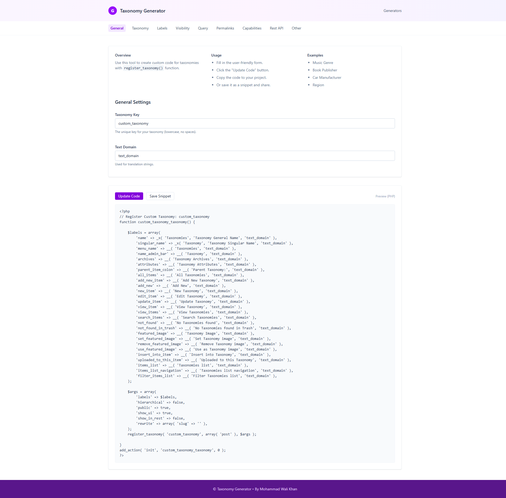

# WordPress Taxonomy Generator

A modern, user-friendly React application for generating WordPress taxonomy registration code. Built with **React**, **Vite**, and **Tailwind CSS**.



## 🚀 Features

*   **Visual Configuration**: Intuitive form-based interface to configure all `register_taxonomy()` arguments.
*   **Live Preview**: Real-time PHP code generation as you edit settings.
*   **Comprehensive Options**: Support for all major taxonomy arguments including:
    *   **General**: Taxonomy key, text domain.
    *   **Labels**: Custom labels for admin UI (Menu name, Singular/Plural names, etc.).
    *   **Visibility**: Public, UI, REST API, Admin Columns, etc.
    *   **Query**: Public queryable, query var.
    *   **Permalinks**: Slug customization, rewrite rules.
    *   **Capabilities**: Custom capabilities for managing terms.
    *   **REST API**: Custom REST base and controller class.
*   **One-Click Copy/Download**: Easily copy the generated code or download it as a `.php` snippet.
*   **Modern UI**: Clean, responsive "Electric Purple" theme built with Tailwind CSS.

## 🛠️ Tech Stack

*   [React](https://react.dev/) - UI Library
*   [Vite](https://vitejs.dev/) - Build Tool
*   [Tailwind CSS](https://tailwindcss.com/) - Styling

## 📦 Installation

1.  **Clone the repository**
    ```bash
    git clone https://github.com/yourusername/taxonomy-generator.git
    cd taxonomy-generator
    ```

2.  **Install dependencies**
    ```bash
    npm install
    ```

3.  **Start the development server**
    ```bash
    npm run dev
    ```

4.  **Build for production**
    ```bash
    npm run build
    ```

## 📖 Usage

1.  Open the application in your browser.
2.  Navigate through the tabs (General, Taxonomy, Labels, etc.) to configure your taxonomy.
3.  The PHP code in the preview pane will update automatically.
4.  Click **Update Code** to force a refresh if needed.
5.  Click **Save Snippet** to download the code as a PHP file.
6.  Copy and paste the code into your WordPress theme's `functions.php` file or a custom plugin.

## 👨‍💻 Author

**Mohammad Wali Khan**

## 📄 License

This project is open source and available under the [MIT License](LICENSE).

---

*Inspired by GenerateWP.*
